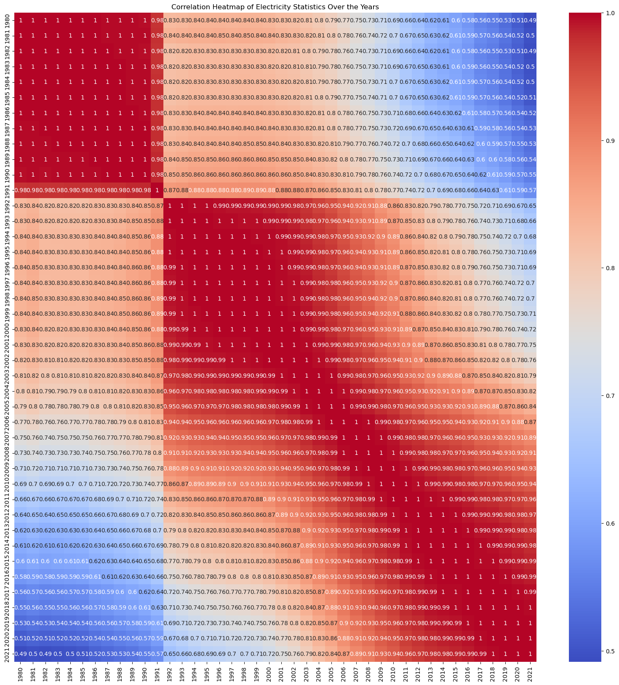

# Global Electricity Statistics Analysis

This repository contains a comprehensive analysis of global electricity statistics from 1980 to 2021.

## Dataset

The dataset used is `Global_Electricity_Statistics.csv`, which contains electricity statistics for various countries over several decades.

## Analysis

The analysis includes:
- Data cleaning and preprocessing
- Exploratory Data Analysis (EDA)
- Trend analysis and visualizations
- Correlation analysis

### Data Cleaning and Preprocessing

- Replaced '--' with 0
- Converted year columns to numeric types

### Exploratory Data Analysis (EDA)

1. **Total Electricity Statistics Over the Years**:
   - Visualized the total electricity statistics from 1980 to 2021.
   

2. **Top 10 Countries by Electricity Statistics**:
   - Visualized the top 10 countries by electricity statistics for the years 1980 and 2020.
   
   

3. **Regional Analysis**:
   - Summarized and visualized electricity statistics by region for the years 1980 and 2020.
   
   

### Advanced Analysis

1. **Correlation Analysis**:
   - Generated a heatmap to visualize the correlation between different years.
   

## How to Use

1. Clone the repository:
    ```bash
    git clone https://github.com/ibroraheem/global_electricity.git
    ```
2. Navigate to the repository:
    ```bash
    cd global_electricity`
    ```
3. Install the required libraries:
    ```bash
    pip install -r requirements.txt
    ```
4. Open the Jupyter Notebook:
    ```bash
    jupyter notebook electricity_analysis.ipynb
    ```

## Results

The analysis results are documented in the Jupyter Notebook. Below are some key findings and visualizations:

- The total electricity statistics have shown a significant increase from 1980 to 2021.
- The top 10 countries by electricity statistics have changed over the years, with notable growth in countries like China and India.
- Regional analysis highlights the dominance of certain regions in electricity consumption over the decades.
- Correlation analysis shows strong correlations between consecutive years, indicating consistent trends over time.

## Conclusion

This analysis provides insights into the trends and patterns in global electricity statistics over the past decades, highlighting significant growth in certain regions and changes in the top electricity-consuming countries.

## Author

- [Ibrahim Abdulraheem](https://github.com/ibroraheem)

## License

This project is licensed under the MIT License - see the [LICENSE](LICENSE) file for details.